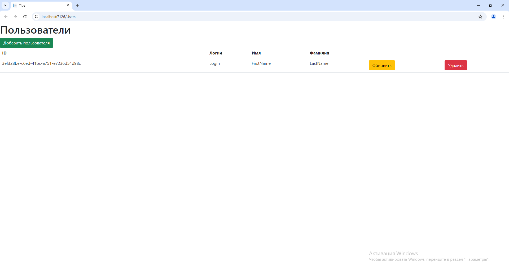
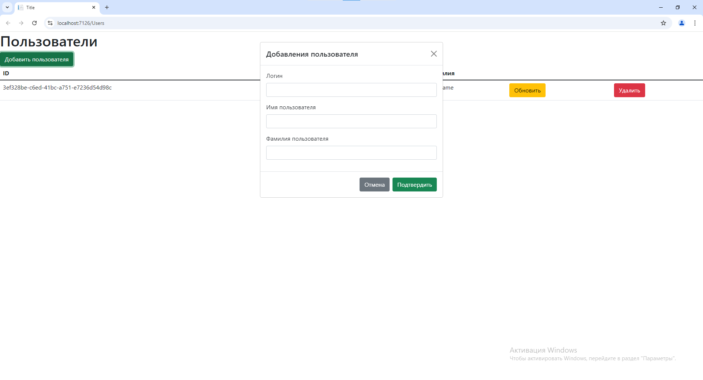
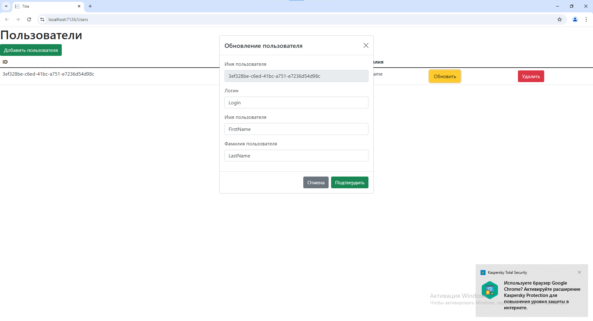
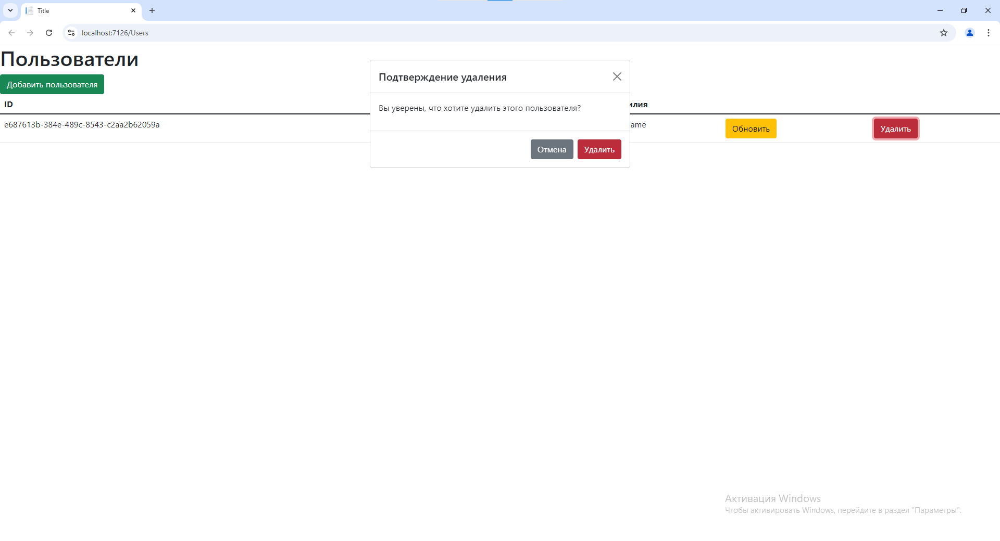
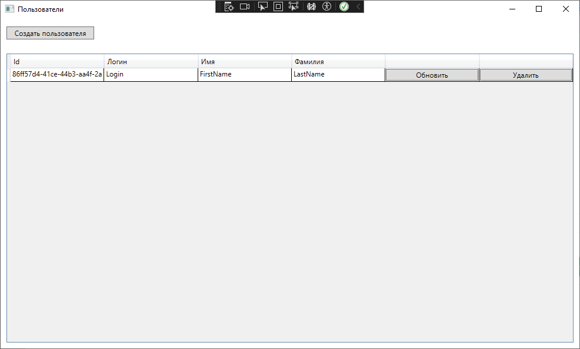
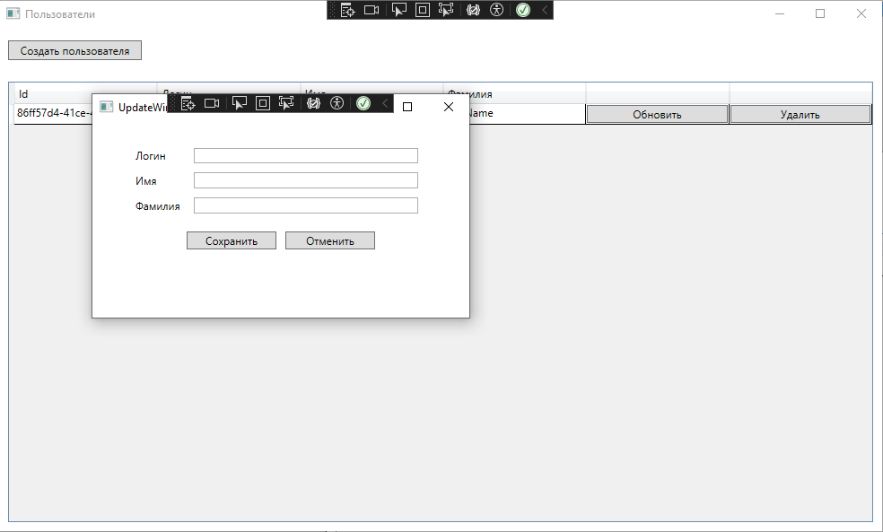
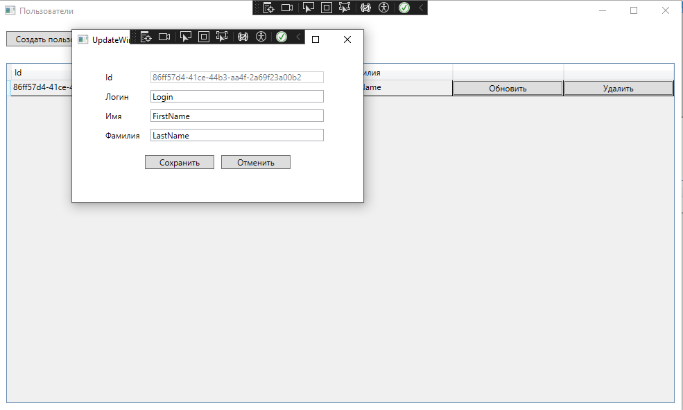
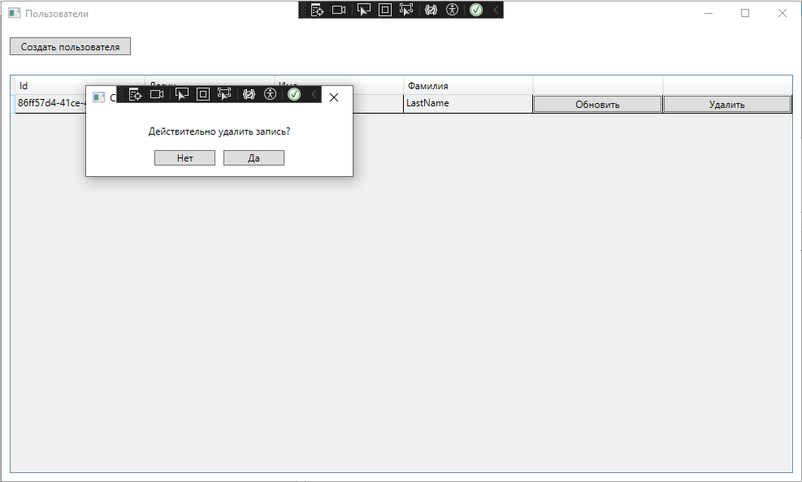

# Syfora

## Описание 
Приложение, реализующее CRUD операции с различными поставщиками данных (PostgreSql, Xml файл, хранилище в оперативной памяти) и имеющее широкие возможности для работы как с веб приложением, так и с десктоп
Помимо этого в приложении просто реализовывать новые сущности, необходимо реализовать один из базовых репозиториев, если новая сущность имеет Id типа Guid

### Смена интерфейса
Для этого необходимо просто сменить запускаемый проект рядом с кнопкой запуска
Также в WebApp можно выбрать swagger для тестирования методов контроллеров

### Смена поставщика
Для этого необходимо в файле appsettings.json ProviderType на один из 
- **InMemoryProvider** - Хранилище в оперативной памяти
- **PostgreSqlProvider** - Бд PostgreSql
- **XmlStorageProvider** - Xml файл

## Скриншоты 
### Web 
Таблица с пользователями

Добавление пользователя

Обновление пользователя (Guid нельзя изменить)

Удаление пользователя

### Wpf
Таблица с пользователями

Добавление пользователя

Обновление пользователя (Guid нельзя изменить)

Удаление пользователя

